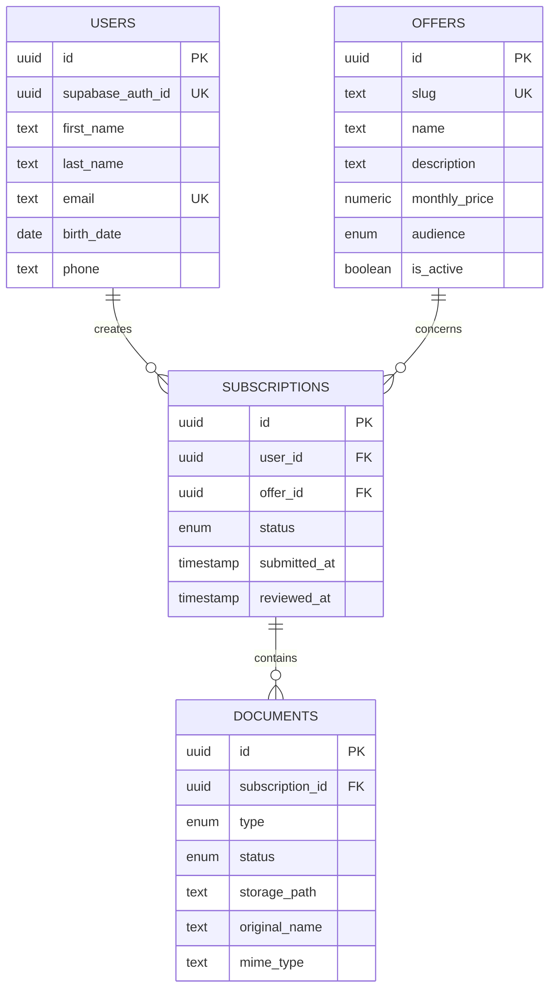

# Modele conceptuel de donnees

```mermaid
erDiagram
    USERS ||--o{ SUBSCRIPTIONS : creates
    OFFERS ||--o{ SUBSCRIPTIONS : concerns
    SUBSCRIPTIONS ||--o{ DOCUMENTS : contains

    USERS {
        uuid id PK
        uuid supabase_auth_id UK
        text first_name
        text last_name
        text email UK
        date birth_date
        text phone
    }

    OFFERS {
        uuid id PK
        text slug UK
        text name
        text description
        numeric monthly_price
        enum audience
        boolean is_active
    }

    SUBSCRIPTIONS {
        uuid id PK
        uuid user_id FK
        uuid offer_id FK
        enum status
        timestamp submitted_at
        timestamp reviewed_at
    }

    DOCUMENTS {
        uuid id PK
        uuid subscription_id FK
        enum type
        enum status
        text storage_path
        text original_name
        text mime_type
    }
```

Les fichiers eux-memes sont destines a Supabase Storage. La table `documents`
ne conserve que leurs metadonnees et leur chemin de stockage.
