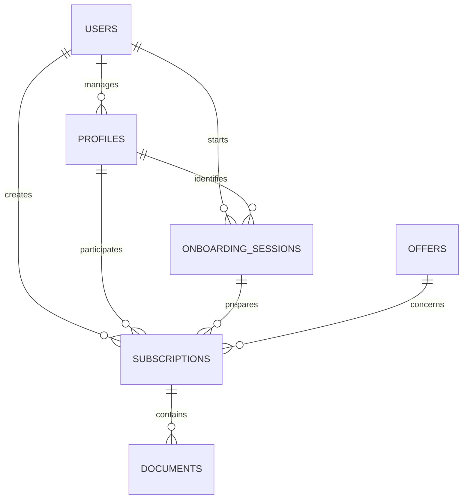

# Modele conceptuel de donnees

- `users` : compte authentifie et consentement RGPD.
- `profiles` : personne porteuse ou payeuse.
- `onboarding_sessions` : choix et reponses du parcours guide.
- `offers` : catalogue des offres et justificatifs potentiels.
- `subscriptions` : demande reliant toutes les entites metier.
- `documents` : metadonnees des justificatifs futurs.

Les fichiers eux-memes sont destines a un stockage protege. La table
`documents` ne conserve que l'URL, le type, le statut et le motif de refus.
