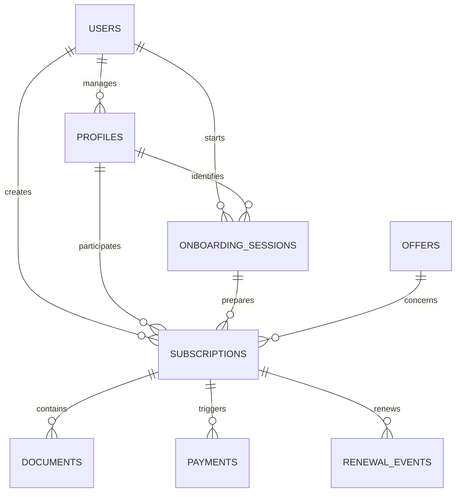

# Modele conceptuel de donnees

- `users` : compte authentifie et consentement RGPD.
- `profiles` : personne porteuse ou payeuse.
- `onboarding_sessions` : choix et reponses du parcours guide.
- `offers` : catalogue des offres et justificatifs potentiels.
- `subscriptions` : demande reliant toutes les entites metier.
- `documents` : metadonnees des justificatifs futurs.
- `payments` : simulations et paiements prototype sans vrai prestataire.
- `renewal_events` : decisions de renouvellement, refus ou suspension.

Les fichiers eux-memes sont destines a un stockage protege. La table
`documents` ne conserve que l'URL, le type, le statut et le motif de refus.

La table `payments` conserve des montants en centimes, un statut et des
metadonnees de demonstration. Elle ne doit pas stocker de carte bancaire ni
d'IBAN complet. Pour un mandat SEPA prototype, seul `ibanLast4` est conserve.

La table `renewal_events` permet de reconstruire une timeline support : qui a
accepte, refuse ou suspendu un renouvellement, et quand.
